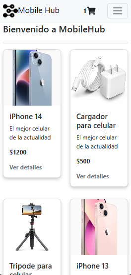
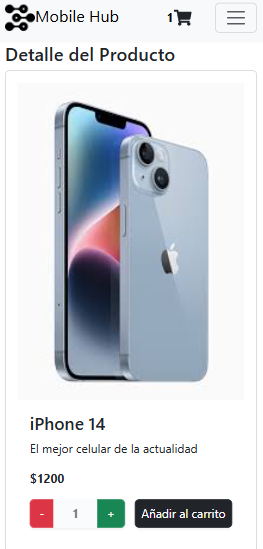

# E-commerce Mobile Hub

### Autor: Juan Ignacio Fernandez  
**Plataforma:** [CoderHouse](https://www.coderhouse.com)  
**Curso:** React JS '100% en vivo'  
**Comisión:** 63395  

---

## Descripción

**E-commerce Mobile Hub** fue diseñado pensado para dispositivos mobiles debido a la gran cantidad de usuarios que acceden a las aplicaciones primero por mobile a comparación de DeskTop. El proyecto fue diseñado con un diseño responsive desde su inicio y consta de un ecommerce de celulares, accesorios de celulares y laptops. 

Tome inspiración de la web y fui creando y diseñado el proyecto según lo iba desarrollando como para que sea funcional y plasentero de ver pero como observación propia debería mejorar los fonts y a lo mejor lo hice muy monotono al diseño.

---

## Feedback de la cursada

Me gusto la cursada la sentí muy tranquila y relajada me dio lugar para hacer mi trabajo y mis responsabilidades y llevar al curso sin problemas. Sentí un buen feedback de mi tutor al corregir mis tareas. 10/10 a el profesor Martin y 10/10 a el tutor Josué. Habia escuchado muchas historias de terror sobre estas plataformas pero me cambiaron completamente la opinión una pena que no pueda elegirlos de vuelta para otra cursada.

---

## Dependencias

Este proyecto utiliza las siguientes dependencias que agregan valor al desarrollo:  

- **[Bootstrap](https://getbootstrap.com)**: Ayuda a construir interfaces responsivas con un diseño limpio y profesional.  
- **[Firebase](https://firebase.google.com)**: Facilita la autenticación y el manejo de bases de datos en tiempo real. Ideal para e-commerce.  
- **[React](https://react.dev)**: La base del proyecto, permite construir interfaces dinámicas y reactivas.  
- **[React Bootstrap](https://react-bootstrap.github.io)**: Una integración de Bootstrap con React que simplifica el uso de componentes.  
- **[React DOM](https://react.dev)**: Maneja cómo React interactúa con el DOM, esencial para aplicaciones modernas.  
- **[React Icons](https://react-icons.github.io/react-icons)**: Ofrece una gran variedad de íconos personalizables para mejorar el diseño visual.  
- **[React Router DOM](https://reactrouter.com)**: Facilita la navegación entre diferentes páginas y vistas dentro de la aplicación.  

---

## Vista previa del proyecto

  
  

